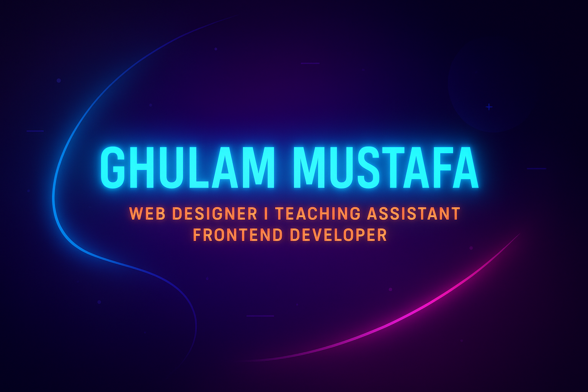
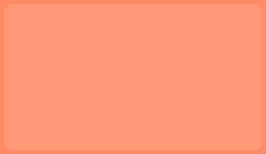
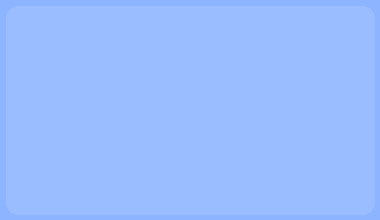
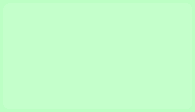

<!-- ========================= TOP ========================= -->

<!-- Hero Banner -->
<!-- ========================= TOP ========================= -->

<!-- Neon Wave Header -->

<!-- Hero Banner -->

  

<!-- Typing Animation (Top) -->

  

<!-- ========================= MIDDLE ========================= -->

## 👨‍🏫 About Me
🌟 **Web Designer** & **Teaching Assistant** helping students master **HTML, CSS & Bootstrap**  
⚡ Exploring **JavaScript & Frontend Frameworks**  
🎯 Love to create **modern, responsive, animated web designs**  

---

## 🛠️ Tech Stack

  

---

## 🚀 Featured Projects

  &nbsp;
  &nbsp;
  

---

## 📊 GitHub Analytics

  
  

  

---

## 🌍 Connect With Me

  
  
  

---

<!-- ========================= BOTTOM ========================= -->

<!-- Neon Wave Footer -->

  

<!-- Typing Animation (Bottom) -->

  

<!-- Sparkle Effect -->

  

